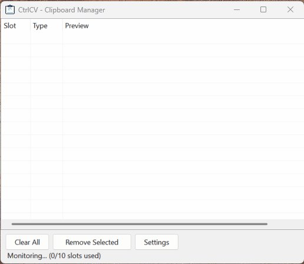

<style>
.download-btn {
  display: inline-block;
  padding: 14px 36px;
  font-size: 1.25rem;
  font-weight: bold;
  color: #fff !important;
  background-color: #1e6f28;
  border-radius: 8px;
  text-decoration: none !important;
  margin: 8px 8px 8px 0;
  transition: background-color 0.2s;
}
.download-btn:hover { background-color: #165a20; }
.github-btn {
  display: inline-block;
  padding: 14px 36px;
  font-size: 1.25rem;
  font-weight: bold;
  color: #fff !important;
  background-color: #333;
  border-radius: 8px;
  text-decoration: none !important;
  margin: 8px 8px 8px 0;
  transition: background-color 0.2s;
}
.github-btn:hover { background-color: #555; }
.download-box {
  text-align: center;
  margin: 32px 0;
  padding: 24px;
  background: #f6f8fa;
  border-radius: 10px;
}
</style>

# Multi-Slot Clipboard Manager for Windows

Copy up to 10 items, paste any of them instantly with a hotkey, and capture screenshots -- all from one lightweight app.

<div class="download-box">
  <a href="https://github.com/keatkean/CtrlCV/releases/latest" class="download-btn">Download Latest Release</a>
  <a href="https://github.com/keatkean/CtrlCV" class="github-btn">View on GitHub</a>
  <br><small>Windows 10+ (x64) &middot; No installation required &middot; Single-file EXE</small>
</div>

---

## How It Works

1. **Copy anything as usual** (Ctrl+C) -- each copied item is automatically saved into a numbered slot.
2. **Paste a specific slot** using a hotkey (default: Ctrl+1 through Ctrl+0).
3. **Take a screenshot** with a global hotkey (default: Ctrl+Alt+PrintScreen) -- choose full screen, active window, or drag-to-select a region.

When all slots are full, the oldest unpinned item is replaced. Pin important items to protect them from being evicted.



---

## Features

| Feature | Description |
|---|---|
| **Multi-slot clipboard** | Stores up to 10 text and image items with FIFO rotation |
| **Pin items** | Protect important items from being replaced |
| **Global hotkeys** | Paste from any slot in any application |
| **Screenshot tool** | Full screen, active window, or region selection |
| **Context menu** | Pin, remove, or clear items directly from the list |
| **Multi-select** | Select multiple items with Ctrl+click or Shift+click, then delete in one go |
| **Configurable** | Change hotkey modifiers, max slots, startup behavior |
| **System tray** | Minimize to tray with quick-action context menu |
| **DPI-aware** | Scales correctly across different displays and scaling settings |
| **Single instance** | Prevents multiple copies from running |
| **Start with Windows** | Optional auto-start at login |

---

## Default Hotkeys

| Shortcut | Action |
|---|---|
| Ctrl+1 ... Ctrl+9 | Paste slot 1 through 9 |
| Ctrl+0 | Paste slot 10 |
| Ctrl+Alt+PrintScreen | Take a screenshot (opens mode picker) |

Hotkey modifiers are configurable in Settings (Ctrl, Ctrl+Alt, or Ctrl+Shift).

---

## Screenshot Modes

When you press the screenshot hotkey, a context menu appears with three options:

- **Full Screen** -- captures all monitors
- **Active Window** -- captures the currently focused window
- **Select Region** -- opens a crosshair overlay where you drag to select an area

Captured screenshots are stored in the next available slot and placed on the clipboard.

---

## Settings

| Setting | Default | Description |
|---|---|---|
| Paste hotkey modifier | Ctrl | Modifier for paste hotkeys (Ctrl, Ctrl+Alt, Ctrl+Shift) |
| Maximum slots | 10 | Number of clipboard slots (1-10) |
| Screenshot hotkey modifier | Ctrl+Alt | Modifier for screenshot hotkey |
| Start minimized | Off | Launch minimized to system tray |
| Run at Windows startup | Off | Auto-start when you log in |

Settings are saved to `%APPDATA%\CtrlCV\settings.json`.

---

## Requirements

- Windows 10 or later (x64)
- [.NET 8 Desktop Runtime](https://dotnet.microsoft.com/en-us/download/dotnet/8.0) (LTS) -- not needed if using the self-contained single-file EXE

---

## Build from Source

```bash
dotnet build
dotnet run
```

Or open `CtrlCV.sln` in Visual Studio 2022 and press F5.

To create a self-contained single-file EXE:

```bash
dotnet publish -p:PublishProfile=SingleFileExe
```

The output is a single `CtrlCV.exe` in `bin\Publish\`. Copy it to any Windows 10+ (x64) machine and run -- no installation or runtime required.

---

## Known Limitations

- **Hotkey conflicts** -- Global hotkeys may override shortcuts in other apps. Change the modifier in Settings to avoid conflicts.
- **Elevated apps** -- Pasting into apps running as Administrator requires CtrlCV to also run as Administrator.
- **No persistence** -- Clipboard slots are stored in memory only and are lost when the app exits.
- **Text and images only** -- Other clipboard formats (files, rich text, etc.) are not captured.

---

## License

This project is licensed under the [GNU General Public License v3.0](https://github.com/keatkean/CtrlCV/blob/main/LICENSE).

---

<div class="download-box">
  <strong style="font-size: 1.1rem;">Ready to try CtrlCV?</strong><br><br>
  <a href="https://github.com/keatkean/CtrlCV/releases/latest" class="download-btn">Download Latest Release</a>
  <br><small>Windows 10+ (x64) &middot; No installation required &middot; Single-file EXE</small>
</div>

<p style="text-align: center; color: #888; font-size: 0.85em;">
  Made by <a href="https://github.com/keatkean">keatkean</a> &middot;
  <a href="https://github.com/keatkean/CtrlCV">Source Code</a> &middot;
  <a href="https://github.com/keatkean/CtrlCV/releases/latest">Releases</a>
</p>
